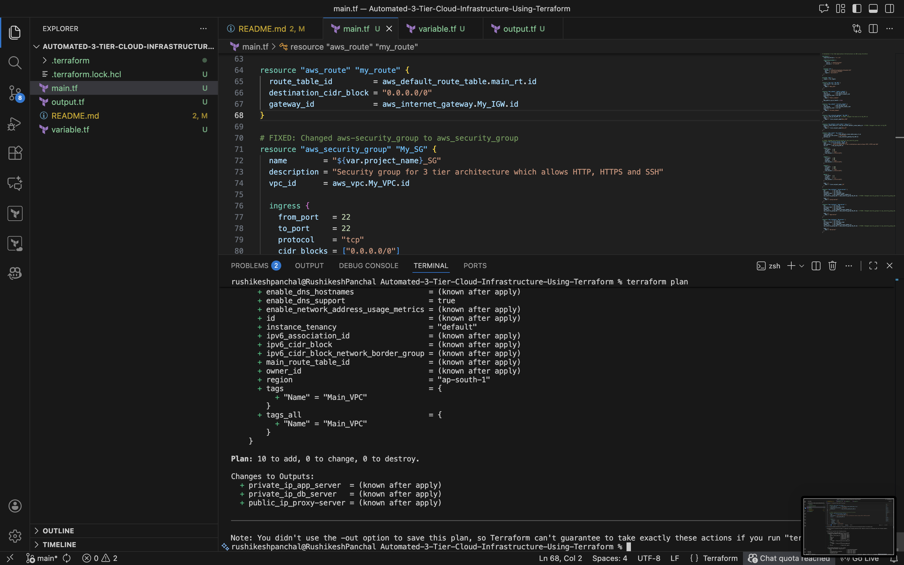

# 🏗️ Automated 3-Tier Web Application Infrastructure on AWS using Terraform

This Terraform project sets up a robust 3-tier web application architecture on AWS, ensuring optimal performance, security, and scalability. The architecture consists of a public web tier, a private application tier, and a private database tier.

# 📋 Table of Contents

* Overview
* Architecture Diagram
* Features
* Prerequisites
* Project Structure
* Configuration Files
* Deployment Steps
* Outputs
* Cleanup Instructions

# 🌟 Overview

This Terraform project automates the deployment of a 3-tier web application architecture on AWS. The infrastructure follows industry best practices by separating components into distinct layers for better security, scalability, and maintainability.

# 🎯 Three Tiers

* Web Tier (Public) - Proxy/Reverse Proxy Server

* Application Tier (Private) - Business Logic/App Server

* Database Tier (Private) - Database Server

# 🏗️ Architecture Diagram

```text
┌─────────────────────────────────────────────────────────────┐
│                     Internet Gateway                         │
└───────────────────────────┬─────────────────────────────────┘
                            │
                    ┌───────▼────────┐
                    │   Public Subnet│
                    │ 10.0.0.0/20    │
                    │  ap-south-1a   │
                    │                │
                    │ ┌────────────┐ │
                    │ │Proxy Server│◄─┐
                    │ │  (EC2)     │  │
                    │ └────────────┘  │
                    └─────────────────┘
                            │
                    ┌───────▼────────┐
                    │  Private Subnet│
                    │ 10.0.16.0/20   │
                    │  ap-south-1a   │
                    │                │
                    │ ┌────────────┐ │
                    │ │ App Server │ │
                    │ │   (EC2)    │ │
                    │ └────────────┘ │
                    │                │
                    │ ┌────────────┐ │
                    │ │ DB Server  │ │
                    │ │   (EC2)    │ │
                    │ └────────────┘ │
                    └─────────────────┘
```

# ✨ Features

* ✅ Complete VPC setup with public and private subnets
* ✅ Internet Gateway for public internet access
* ✅ Security Groups with appropriate ingress/egress rules
* ✅ Three EC2 instances (one in public, two in private subnet)
* ✅ State management using S3 backend
* ✅ Tagging strategy for resource identification
* ✅ Modular design with variables for easy customization
* ✅ High availability ready architecture

# 📋 Prerequisites

🔧 Tools Required:

* Terraform (≥ 1.0.0)
* AWS CLI configured with credentials
* AWS Account with appropriate permissions
* SSH Key Pair in Mumbai (ap-south-1) region

# 🔐 AWS Permissions Required

* AmazonEC2FullAccess
* AmazonVPCFullAccess
* AmazonS3FullAccess (for state backend)
* IAM permissions for resource creation

# 📁 Project Structure

```plaintext
3-tier-aws-terraform/
├── 📄 main.tf           # Main Terraform configuration
├── 📄 variables.tf      # Variable definitions
├── 📄 outputs.tf        # Output definitions
└── 📄 terraform.tfvars  # Variable values
```

# ⚙️ Configuration Files

## 📄 main.tf

``` bash
terraform {
  required_version = ">= 1.0"

  required_providers {
    aws = {
      source  = "hashicorp/aws"
      version = "~> 6.24.0"
    }
  }

  backend "s3" {
    bucket = "statefile-backend-s3-bucket-123"
    key    = "terraform.tfstate"
    region = "ap-south-1"
  }
}

provider "aws" {
  region = var.region
}

# VPC Configuration
resource "aws_vpc" "My_VPC" {
  cidr_block = var.vpc_cidr
  tags = {
    Name = "Main_VPC"
  }
}

# Subnet Configuration
resource "aws_subnet" "public_subnet" {
  vpc_id            = aws_vpc.My_VPC.id
  cidr_block        = var.public_subnet_cidr
  availability_zone = var.az1
  tags = {
    Name = "Public_Subnet"
  }
  map_public_ip_on_launch = true
}

resource "aws_subnet" "private_subnet" {
  vpc_id            = aws_vpc.My_VPC.id
  cidr_block        = var.private_subnet_cidr
  availability_zone = var.az1
  tags = {
    Name = "Private_Subnet"
  }
}

# Networking Components
resource "aws_internet_gateway" "My_IGW" {
  vpc_id = aws_vpc.My_VPC.id  
  tags = {
    Name = "${var.project_name}Main_IGW"
  }
}

resource "aws_default_route_table" "main_rt" {
  default_route_table_id = aws_vpc.My_VPC.default_route_table_id  
  tags = {
    Name = "${var.project_name}Main_RT"
  }
}

resource "aws_route" "my_route" {
  route_table_id         = aws_default_route_table.main_rt.id
  destination_cidr_block = "0.0.0.0/0"
  gateway_id             = aws_internet_gateway.My_IGW.id
}

# Security Group
resource "aws_security_group" "My_SG" {
  name        = "${var.project_name}_SG"
  description = "Security group for 3 tier architecture which allows HTTP, HTTPS and SSH"
  vpc_id      = aws_vpc.My_VPC.id

  ingress {
    from_port   = 22
    to_port     = 22
    protocol    = "tcp"
    cidr_blocks = ["0.0.0.0/0"]
  }

  ingress {
    from_port   = 80
    to_port     = 80
    protocol    = "tcp"
    cidr_blocks = ["0.0.0.0/0"]
  }

  ingress {
    from_port   = 443
    to_port     = 443
    protocol    = "tcp"
    cidr_blocks = ["0.0.0.0/0"]
  }

  egress {
    from_port   = 0
    to_port     = 0
    protocol    = "-1"
    cidr_blocks = ["0.0.0.0/0"]
  }

  tags = {
    Name = "${var.project_name}_SG"
  }
}

# EC2 Instances
resource "aws_instance" "proxy-server" {
  ami           = var.ami_id
  key_name      = var.key_name
  instance_type = var.instance_type
  subnet_id     = aws_subnet.public_subnet.id
  vpc_security_group_ids = [aws_security_group.My_SG.id]  

  tags = {
    Name = "proxy-server"
  }
}

resource "aws_instance" "app-server" {
  ami           = var.ami_id
  instance_type = var.instance_type
  key_name      = var.key_name
  subnet_id     = aws_subnet.private_subnet.id
  vpc_security_group_ids = [aws_security_group.My_SG.id]  

  tags = {
    Name = "app-server"
  }
}

resource "aws_instance" "db-server" {
  ami           = var.ami_id
  instance_type = var.instance_type
  key_name      = var.key_name
  subnet_id     = aws_subnet.private_subnet.id
  vpc_security_group_ids = [aws_security_group.My_SG.id]  

  tags = {
    Name = "db-server"
  }
}
```

## 📄 variables.tf

``` bash
variable "region" {
  default = "ap-south-1"
}

variable "az1" {
  default = "ap-south-1a"
}

variable "vpc_cidr" {
  default = "10.0.0.0/16"
}

variable "public_subnet_cidr" {
  default = "10.0.0.0/20"
}

variable "private_subnet_cidr" {
  default = "10.0.16.0/20"
}

variable "instance_type" {
  default = "t2.micro"
}

variable "ami_id" {
  default = "ami-0d176f79571d18a8f" # Amazon Linux 2 AMI (HVM), SSD Volume Type
}

variable "key_name" {
  default = "Mumbai_server_key"
}

variable "project_name" {
  default = "Three_Tier_Architecture"
}
```

## 📄 outputs.tf

``` bash
output "public_ip_proxy-server" {
  value = aws_instance.proxy-server.public_ip
}

output "private_ip_app_server" {
  value = aws_instance.app-server.private_ip
}

output "private_ip_db_server" {
  value = aws_instance.db-server.private_ip
}
```

# 🚀 Deployment Steps

## Step 1: Clone/Setup Project

```bash
# Create project directory
mkdir 3-tier-aws-terraform
cd 3-tier-aws-terraform
# Create the three configuration files
touch main.tf variables.tf outputs.tf
```

## Step 2: Initialize Terraform

``` bash
terraform init
```


## Step 3: Format and Validate Code

```bash
# Validate configuration
terraform validate
```


## Step 4: Plan Deployment

```bash
terraform plan
```



## Step 5: Apply Configuration

```bash
terraform apply -auto-approve
```


## Step 6: Verify Deployment

```bash
# Check outputs
terraform output
# List all created resources
terraform state list
```

# 📊 Outputs

After successful deployment, you'll see:

```text
Apply complete! Resources: 10 added, 0 changed, 0 destroyed.

Outputs:

proxy-server_public_ip = "XX.XX.XX.XX"
db_server_private_ip = "10.0.16.XX"
app_server_private_ip = "10.0.16.XX"
```

# 🧹 Cleanup Instructions

To avoid ongoing charges, destroy all resources:

```bash
# Review what will be destroyed
terraform plan -destroy

# Destroy all resources
terraform destroy -auto-approve
```

# 📚 Resources & References

* AWS Documentation
* Terraform AWS Provider
* 3-Tier Architecture Best Practices

# 📌 Author

Developed by Rushikesh Panchal – Cloud/DevOps Engineer 🚀
